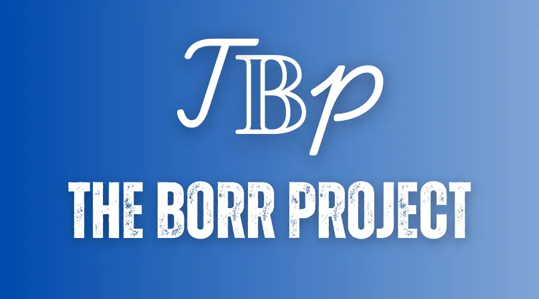

# Computer Science Overview

The Borr Project curriculum is a **complete education in computer science** using online materials.
It's not merely for career training or professional development.
It's for those who want a proper, *well-rounded* grounding in concepts fundamental to all computing disciplines,
and for those who have the discipline, will, and (most importantly!) good habits to obtain this education largely on their own,
but with support from a worldwide community of fellow learners.

It is designed according to the degree requirements of undergraduate computer science majors, minus general education (non-CS) requirements,
as it is assumed most of the people following this curriculum are already educated outside the field of CS.
The courses themselves are among the very best in the world, often coming from Harvard, Princeton, MIT, etc.,
but specifically chosen to meet the following criteria.

**Courses must**:

- Be open for enrollment
- Run regularly (ideally in self-paced format, otherwise running multiple times per year)
- Be of generally high quality in teaching materials and pedagogical principles
- Match the curricular standards of the [CS 2013](curricular_guidelines): Curriculum Guidelines for Undergraduate Degree Programs in Computer Science

When no course meets the above criteria, the coursework is supplemented with a book.
When there are courses or books that don't fit into the curriculum but are otherwise of high quality,
they belong in [extras/courses](extras/courses) or [extras/readings](extras/readings). Some may be mentioned as supplemental to the recommended course.

**Organization**. The curriculum is designed as follows:

- *[Intro CS](#intro-cs)*: for students to try out CS and see if it's right for them
- *[Core CS](#core-cs)*: corresponds roughly to the first three years of a computer science curriculum, taking classes that all majors would be required to take
- *[Advanced CS](#advanced-cs)*: corresponds roughly to the final year of a computer science curriculum, taking [electives](advanced-cs/electives/index.md) according to the student's interests and a [final project](advanced-cs/final-project/index.md) for students to validate, consolidate, and display their knowledge, to be evaluated by their peers worldwide

**Duration**. It is possible to finish within about 2 years if you plan carefully and devote roughly 20 hours/week to your studies. Learners can use [this spreadsheet](https://docs.google.com/spreadsheets/d/1Pp4z-ulYDT9Px88oTQP5FJiZWyk8LcF7cBvc6SVXu6o/copy) to estimate their end date. Make a copy and input your start date and expected hours per week in the `Timeline` sheet. As you work through courses you can enter your actual course completion dates in the `Curriculum Data` sheet and get updated completion estimates.
  
> **Warning:** While the spreadsheet is a useful tool to estimate the time you need to complete this curriculum, it may not always be up-to-date with the curriculum. Use the [Borr Project website](https://borrproject.github.io) to see what courses to do.

**Cost**. All or nearly all course material is available for free. However, some courses may charge money for assignments/tests/projects to be graded.
Note that both [Coursera](https://www.coursera.support/s/article/209819033-Apply-for-Financial-Aid-or-a-Scholarship?language=en_US) and [edX](https://courses.edx.org/financial-assistance/) offer financial aid.

Decide how much or how little to spend based on your own time and budget;
just remember that you can't purchase success!

**Process**. Students can work through the curriculum alone or in groups, in order or out of order.
- We recommend doing all courses in Core CS, only skipping a course when you are certain that you've already learned the material previously.
- For simplicity, we recommend working through courses (especially Core CS) in order from top to bottom. Some students choose to study multiple courses at a time in order to vary the material they are working on in a day/week. A popular option is to take the math courses in parallel with the introductory courses. Course prerequisites are listed to help you determine if you are prepared for a given course.
- Courses in Advanced CS are electives. Choose one subject (e.g. Advanced programming) you want to become an expert in and take all the courses under that heading. You can also create your own custom subject; the Discord community may provide feedback on your planned subject.

**Content policy**. If you plan on showing off some of your coursework publicly, you must share only files that you are allowed to.
*Respect the code of conduct* that you signed in the beginning of each course!

**[How to contribute](../contributing)**

**[Getting help](../getting-help)** (Details about our FAQ and chatroom)

## Community

- We have a Discord server!  This should be your first stop to talk with other Borr project students. Why don't you introduce yourself right now? [Join the Borr Project Discord](https://discord.gg/uR2QS36pdH)
- You can also interact through GitHub issues. If there is a problem with a course, or a change needs to be made to the curriculum, this is the place to start the conversation. Read more [here](../contributing).

> **Warning:** There are a few third-party/deprecated/outdated material that you might find when searching for Borr Project or OSSU. We recommend you to ignore them, and only use the [Borr Project website](https://borrproject.github.io). Some known outdated materials are:
>  - OSSU repos and websites
>  - An unmaintained and deprecated firebase app
>  - An unmaintained and deprecated trello board
>  - Third-party notion templates

## Intro CS

### Prerequisites

*Timeline: 0 - 2 years*

Get a thorough idea of what it takes to begin study of Computer Science at The Borr Project. While some of these prerequisites may be daunting, they are vital for success in this curriculum. To break things up, feel free to work on Elementary Programming, an optional course that introduces the very basics of programming.

- [Prerequisites & Motivation](prerequisites/index.md)
- [Elementary Programming](prerequisites/elementary-programming.md) (Optional)

### Introduction to Computer Science

*Timeline: 108 - 164 hours*

*Prerequisites: [High school math](../precollege-math/)*

Get a birds eye view of what the field of Computer Science entails. Even if you have programmed in the past, you will find the MIT's Intro to CS with Python to be a great experience in teaching you the basics of computer science. Note that although the course is taught with Python, the focus of the course is not on the particular language, but core concepts of Computer Science.

- [Introduction to CS](intro-cs/index.md)

Understanding theory is important, but you will also be expected to create programs. There are a number of tools that are widely used to make that process easier. MIT's Missing Semester is a course reviewing such tools. Learn them now to ease your future work writing programs.

- [Missing Semester](intro-cs/missing-semester/index.md)

## Core CS

### Program Design

*Timeline: 325 - 500 hours*

*Prerequisites: [High school math](../precollege-math/), [Intro CS](intro-cs/)*

Learn how to think like a programmer and build robust, well-structured, thoroughly-tested software. These courses are the cornerstone of your CS education. You will find that the practical concepts of Data Structures and Algorithms distributed throughout this pathway. More theory-oriented DSA courses come later in the theory track. 

- [Systematic Program Design](program-design/spd/index.md)
- [Class-Based Program Design](program-design/class-based/index.md)
- [Programming Languages](program-design/programming-languages/index.md)
- [Object-Oriented Design](program-design/object-oriented/index.md)
- [Software Architecture](program-design/software-architecture/index.md)

### Math

*Timeline: 1 - 2 years*

*Prerequisites: [High school math](../precollege-math/)*

Build a rigorous foundation in mathematical thinking, which is essential for mastering computer science. The goal is to sharpen your analytical thinking so you can confidently tackle complex computational and algorithmic challenges.

- [Calculus](math/calculus/index.md)
- [Discrete Mathematics](math/discrete-math/index.md)

### Systems

*Timeline: 250 - 500 hours*

*Prerequisites: [Program Design](program-design/)*

Learn how computers actually works. You will build a simulated version of a computer from scratch, learn the inner workings of operating systems, and take a look into how computers communicate with each other.  This track will demystify how the programs you write actually get executed by the computer.

- [Intro to Computer Systems](systems/computer-systems/index.md)
- [Operating Systems](systems/ostep/index.md)
- [Computer Networking](systems/networking/index.md)

### Theory

*Timeline: 64 - 128 hours*

*Prerequisites: [Discrete Math](math/discrete-math/), [Program Design](program-design/)*

Get a perspective into why certain ways of solving a problem are better than others. Learn about complexity and theoretical limits of algorithms. Get an idea of what computers can or cannot do. These courses are the pillars of Computer Science.
- [Theory](theory/index.md)

### Ethics & Security

*Timeline: 167 - 183 hours*

*Prerequisites: [Program Design](program-design/)*

Learn how to think critically about the social impact of technology and protect digital systems against evolving threats. These courses lay the foundation for responsible and secure software development. You will find concepts like privacy, threat modeling, cryptography, and ethical reasoning deeply interwoven throughout this track.

- [Ethics](ethics-security/ethics/index.md)
- [Cybersecurity Fundamentals](ethics-security/cyber-fundamentals/index.md)
- [Secure Coding Practices](ethics-security/secure-coding-practices/index.md)

### Applications

*Timeline: 279 - 291 hours*

*Prerequisites: [Program Design](program-design/)*

Get to know how to use the skills you have learned apply to real world applications of Computer Science. Learn how to design database systems, how computer graphics work, and dip your feet into the world of machine learning. This track ends with teaching you how to tackle large sized real world projects.

- [Databases](applications/databases/index.md)
- [Machine Learning](applications/machine-learning/index.md)
- [Computer Graphics](applications/computer-graphics/index.md)
- [Software Engineering](applications/software-engineering/index.md)

## Advanced CS

*Timeline: varies per student*

*Prerequisites: all tracks included in [Core CS](#core-cs)*

After completing every course in all previous tracks, choose a subset of courses from Advanced CS based on interest. Understand that these are electives; not every course needs to be taken. But take every course that is relevant to the field you intend to go into. You do not need to make this choice until you have completed all previous tracks, and it is suggested to only make the choice after that.

- [Electives](advanced-cs/electives/index.md)

Afterwards, visit our Final Project page to decide how you want to cap off your Computer Science journey. There are many paths you can take your career, and it is up to you to decide where to go.

- [Final Project](advanced-cs/final-project/index.md)

### Congratulations

After completing the requirements of the curriculum above,
you will have completed the equivalent of a full bachelor's degree in Computer Science.
Congratulations!

What is next for you? The possibilities are boundless and overlapping:

- Look for a job as a developer!
- Check out the [readings](extras/readings) for classic books you can read that will sharpen your skills and expand your knowledge.
- Join a local developer meetup (e.g. via [meetup.com](https://www.meetup.com/)).
- Pay attention to emerging technologies in the world of software development:
  + Explore the **actor model** through [Elixir](https://elixir-lang.org/), a new functional programming language for the web based on the battle-tested Erlang Virtual Machine!
  + Explore **borrowing and lifetimes** through [Rust](https://www.rust-lang.org/), a systems language which achieves memory- and thread-safety without a garbage collector!
  + Explore **dependent type systems** through [Idris](https://www.idris-lang.org/), a new Haskell-inspired language with unprecedented support for type-driven development.

## Code of conduct
[Borr Project Code of Conduct](../coc).
